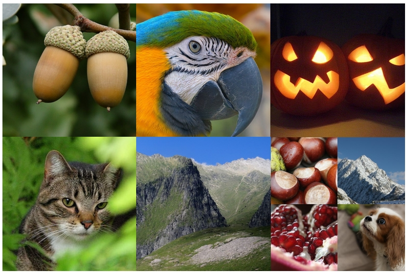
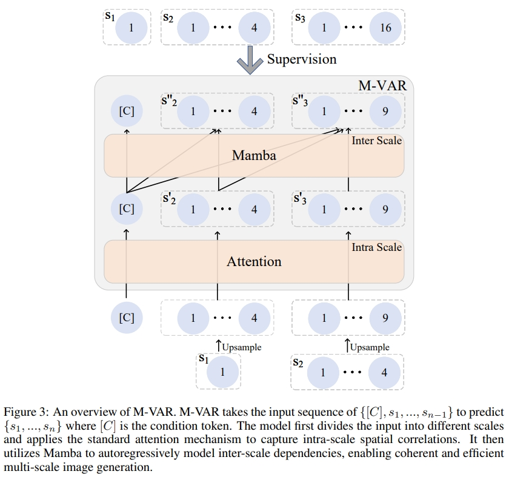

# M-VAR
[[project page](https://oliverrensu.github.io/project/MVAR/mvar)] | [[paper](https://arxiv.org/abs/2411.10433)] | [[code](https://github.com/OliverRensu/MVAR)]


This repository is the official implementation of our [M-VAR: Decoupled Scale-wise Autoregressive Modeling for High-Quality Image Generation](https://arxiv.org/abs/2411.10433)


## Introduction
There exists recent work in computer vision, named VAR, that proposes a new autoregressive paradigm for image generation. Diverging from the vanilla next-token prediction, VAR structurally reformulates the image generation into a coarse to fine next-scale prediction. 
In this paper, we show that this scale-wise autoregressive framework can be effectively decoupled into **intra-scale modeling**, which captures local spatial dependencies within each scale, and **inter-scale modeling**, which models cross-scale relationships progressively from coarse-to-fine scales.
This decoupling structure allows to rebuild VAR in a more computationally efficient manner. Specifically, for intra-scale modeling --- crucial for generating high-fidelity images --- we retain the original bidirectional self-attention design to ensure comprehensive modeling; for inter-scale modeling, which semantically connects different scales but is computationally intensive, we apply linear-complexity mechanisms like Mamba to substantially reduce computational overhead. 
We term this new framework M-VAR. Extensive experiments demonstrate that our method outperforms existing models in both image quality and generation speed. For example, our 1.5B model, with fewer parameters and faster inference speed, outperforms the largest VAR-d30-2B. Moreover, our largest model M-VAR-d32 impressively registers 1.78 FID on ImageNet 256X256 and outperforms the prior-art autoregressive models LlamaGen/VAR by 0.4/0.19 and popular diffusion models LDM/DiT by 1.82/0.49, respectively.



Decoupled scale-wise autoregressive modeling


## Preparation
1. ImageNet dataset
2. [Tokenizer](https://huggingface.co/FoundationVision/var/resolve/main/vae_ch160v4096z32.pth) from VAR


## Training
The hyperparameters of training are same as that in VAR.
```python
# d12
torchrun --nproc_per_node=8 --nnodes=... --node_rank=... --master_addr=... --master_port=... train.py \
  --depth=12 --bs=768 --ep=200 --fp16=1 --alng=1e-3 --wpe=0.1
# d16
torchrun --nproc_per_node=8 --nnodes=... --node_rank=... --master_addr=... --master_port=... train.py \
  --depth=16 --bs=768 --ep=200 --fp16=1 --alng=1e-3 --wpe=0.1
# d20
torchrun --nproc_per_node=8 --nnodes=... --node_rank=... --master_addr=... --master_port=... train.py \
  --depth=20 --bs=768 --ep=250 --fp16=1 --alng=1e-3 --wpe=0.1
# d24
torchrun --nproc_per_node=8 --nnodes=... --node_rank=... --master_addr=... --master_port=... train.py \
  --depth=24 --bs=768 --ep=350 --tblr=8e-5 --fp16=1 --alng=1e-4 --wpe=0.01
# d30
torchrun --nproc_per_node=8 --nnodes=... --node_rank=... --master_addr=... --master_port=... train.py \
  --depth=30 --bs=1024 --ep=350 --tblr=8e-5 --fp16=1 --alng=1e-5 --wpe=0.01 --twde=0.08
```

## Inference
The pretrained weights are avaiable at [huggingface🤗](https://huggingface.co/OliverRen/M-VAR)

For FID evaluation, we set "cfg=1.5, top_p=0.96, top_k=900, more_smooth=False"

For visualizatio, we set "more_smooth=True"

## Citation
If you have any question, feel to to contact [Sucheng Ren](oliverrensu@gmail.com)
```
@article{ren2024mvardecoupledscalewiseautoregressive,
      title={M-VAR: Decoupled Scale-wise Autoregressive Modeling for High-Quality Image Generation}, 
      author={Sucheng Ren and Yaodong Yu and Nataniel Ruiz and Feng Wang and Alan Yuille and Cihang Xie},
      year={2024},
      eprint={2411.10433},
      archivePrefix={arXiv},
      primaryClass={cs.CV},
      url={https://arxiv.org/abs/2411.10433}, 
}
```